# AI Morning Digest

A fully automated daily AI news pipeline that fetches from Reddit, Hacker News, X, and tech blogs every morning at 8 AM, scores everything with Claude Haiku, and delivers a curated digest to your inbox.

Live at [digest.fieldnotes-ai.com](https://digest.fieldnotes-ai.com) · Built by [Nika Karliuchenko](https://www.fieldnotes-ai.com)

---

## What it does

Every morning at 8 AM EST, GitHub Actions runs a pipeline that:

1. Fetches ~150 items from 5 sources simultaneously
2. Scores each item with Claude Haiku 4.5 via the Batch API
3. Deduplicates by topic using Jaccard similarity
4. Stores everything in Supabase
5. Sends a personal digest email with suggested comment angles
6. Updates the public dashboard

Total running cost: ~$0.25/day.

## Architecture



## Tech stack

- **Framework:** Next.js 16.2 App Router, TypeScript, Tailwind CSS
- **Database:** Supabase (Postgres)
- **Email:** Resend
- **Scheduling:** GitHub Actions cron (`0 13 * * *` = 8 AM EST)
- **Scoring:** Claude Haiku 4.5 via Anthropic Batch API
- **Deployment:** Vercel

## Data sources

| Source | Method | Cost |
|---|---|---|
| Reddit | RSS feeds (5 subreddits) | Free |
| Hacker News | Algolia API | Free |
| Anthropic blog | Community RSS (Olshansk/rss-feeds) | Free |
| OpenAI blog | Official RSS | Free |
| Google DeepMind | Official RSS | Free |
| X / Twitter | SocialData.tools keyword search | ~$3/mo |
| Exa | Semantic search API | Free tier |

## Run it yourself

### Prerequisites

- Node.js 22+
- Accounts: Supabase, Resend, SocialData.tools, Exa.ai, Anthropic

### Setup

```bash
git clone https://github.com/nikakarliuchenko/ai-morning-digest.git
cd ai-morning-digest
npm install
```

Copy the environment variables template:

```bash
cp .env.example .env.local
```

Fill in your values in `.env.local`:

```
SOCIALDATA_API_KEY=        # socialdata.tools
EXA_API_KEY=               # exa.ai
ANTHROPIC_API_KEY=         # console.anthropic.com
NEXT_PUBLIC_SUPABASE_URL=  # your Supabase project URL
NEXT_PUBLIC_SUPABASE_ANON_KEY=
SUPABASE_SERVICE_ROLE_KEY=
RESEND_API_KEY=            # resend.com
RESEND_FROM_EMAIL=         # e.g. digest@yourdomain.com
YOUR_EMAIL=                # where your personal digest gets sent
PIPELINE_SECRET=           # any random string, protects the manual trigger endpoint
```

### Database setup

Run the migration in your Supabase SQL editor:

```bash
cat supabase/migrations/001_initial_schema.sql
```

Then:

```bash
cat supabase/migrations/002_add_public_rationale.sql
```

### Run the pipeline locally

```bash
npx tsx --env-file=.env.local scripts/run-pipeline.ts
```

Or for a specific date:

```bash
npx tsx --env-file=.env.local scripts/run-pipeline.ts 2026-03-25
```

### Run the dashboard

```bash
npm run dev
```

Open [localhost:3000](http://localhost:3000).

### Deploy

1. Push to GitHub
2. Import the repo in Vercel -- it auto-detects Next.js
3. Add all env vars in Vercel dashboard
4. Add the same env vars as GitHub Actions secrets
5. The cron job runs automatically at 8 AM EST via `.github/workflows/morning-digest.yml`

## Customize it

The two things most worth changing for your own version:

**Scoring prompt** (`lib/scorer/index.ts`) -- the `SYSTEM_PROMPT` describes who the personal digest is for. Update the stack details (Next.js, Contentful, etc.) to match your own tools and goals.

**Subreddits** (`lib/fetchers/reddit.ts`) -- swap the 5 subreddits for ones relevant to your interests.

Everything else works out of the box.

## How it was built

Full build story in [Field Note #014](https://www.fieldnotes-ai.com/notes/ai-morning-digest-built-with-claude). Two Claude Code sessions, $11.52 in API costs, deployed to production in one day.

## License

MIT. Fork it, change it, ship it.
